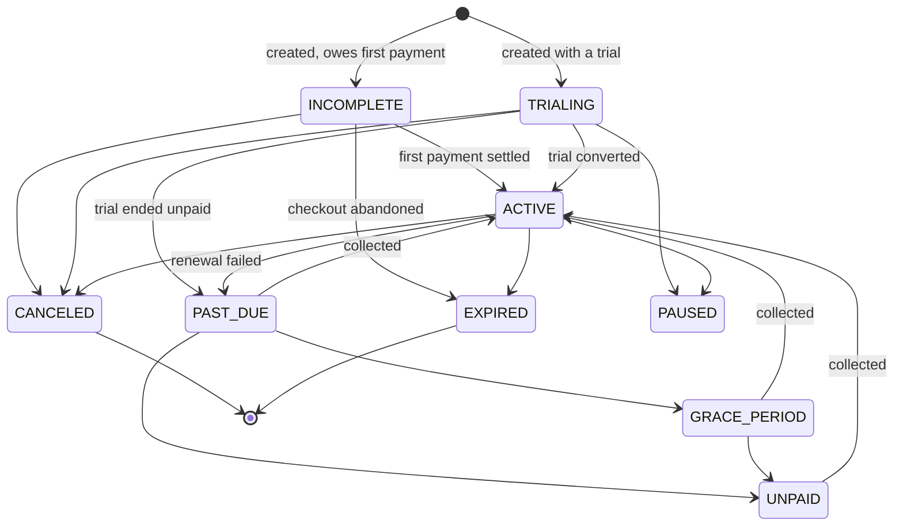

# Tierstack — Systems Architecture

A provider-agnostic billing, subscription, entitlement, usage-metering and
invoicing platform for African software businesses. It sits between a
developer's application and the payment rails (Paystack, Monnify,
Flutterwave), and it — not the rail — is the record of what a customer owes.

> **The one rule everything else follows.** Tierstack is the billing system of
> record. Payment providers move money; they do not decide what is owed, what
> was paid, or what a customer is entitled to. Every provider sits behind an
> adapter and is swappable without touching billing logic.

---

## 1. Repository map

```
tierstack/
├── apps/
│   ├── api/                    Fastify 5 HTTP API — the only writer of business data
│   ├── dashboard/              Next.js 15 App Router — the merchant-facing console
│   ├── portal/                 Next.js — the customer-facing billing page
│   └── site/                   Next.js — the marketing page, static, no API
├── packages/
│   ├── shared/                 money, intervals, ids, errors, config, env loading
│   ├── database/               Prisma client factory (Rust-free driver adapter)
│   ├── billing/                the engine: subscriptions, invoices, pricing, proration,
│   │                           grace periods, payment orchestration
│   ├── entitlements/           feature-access resolution + cache invalidation
│   ├── notifications/          customer email: transports, templates, send-once
│   ├── usage/                  meter definitions, event ingestion, aggregation
│   └── payments/
│       ├── core/               PaymentProvider interface, capabilities, router
│       ├── mock/               a local rail for development
│       └── paystack/           the first real rail
├── workers/
│   ├── billing-worker/         BullMQ: renewals, grace expiry, sweeps
│   └── usage-worker/           BullMQ: usage rollups
├── prisma/                     schema, migrations, seed
└── scripts/                    infra.mjs, e2e.ts, demo-data.ts, verify-paystack.ts
```

Package boundaries are real: `apps/api` orchestrates HTTP concerns and calls
into `packages/billing`. Billing logic never imports Fastify, and never
imports a specific payment provider — only `@tierstack/payments-core`.

## 2. Runtime topology

```
   Developer's app                Merchant                Customer
         │                           │                        │
   API key (sk_…)              session cookie           hosted checkout
         │                           │                        │
         ▼                           ▼                        │
   ┌───────────────────────────────────────────┐              │
   │            apps/api  (Fastify)            │              │
   │  auth · rate limit · idempotency · audit  │              │
   └───────────────┬───────────────┬───────────┘              │
                   │               │                          │
        ┌──────────▼─────┐   ┌─────▼──────────┐               │
        │ packages/*     │   │ payments/core  │               │
        │ billing, usage │   │ router         │               │
        │ entitlements   │   └─────┬──────────┘               │
        └──────────┬─────┘         │                          │
                   │        ┌──────▼───────┐                  │
                   │        │ paystack │ mock │◄──────────────┘
                   │        └──────┬───────┘
                   │               │ webhook (signed)
        ┌──────────▼───────────────▼──────────┐
        │  PostgreSQL 16        Redis 7       │
        │  system of record     cache/queues  │
        └─────────────────────────────────────┘
                   ▲
        ┌──────────┴──────────┐
        │ workers (BullMQ)    │  renewals every 5m · grace 10m
        │ billing · usage     │  incomplete 15m · sweeps hourly
        └─────────────────────┘
```

Redis holds three separate things: BullMQ queues, the entitlement cache, and
rate-limit counters. None of them is authoritative — the database is. Losing
Redis degrades performance, never correctness.

## 3. Data model

The schema is one PostgreSQL database with `organizationId` on every business
row. Models group into seven areas:

| Area | Models |
|---|---|
| Identity | `User`, `Session`, `Organization`, `OrganizationMember`, `ApiKey` |
| Configuration | `BillingSettings`, `PaymentProviderConfig` |
| Catalogue | `Plan`, `Price`, `UsageMeter` |
| Customers & money | `Customer`, `PaymentMethod`, `Subscription`, `SubscriptionTransition`, `Invoice`, `InvoiceLineItem`, `InvoiceCounter`, `PaymentAttempt`, `CreditLedgerEntry` |
| Metering & access | `UsageEvent`, `Entitlement` |
| Growth | `Coupon`, `CouponRedemption`, `ReferralProgram`, `Referral` |
| Operations | `WebhookEvent`, `IdempotencyKey`, `PortalSession`, `AuditLog`, `EmailMessage` |

Prisma runs **without the Rust query engine** — `provider = "prisma-client"`,
`engineType = "client"`, talking to Postgres through `@prisma/adapter-pg`. That
removes the platform-specific binary from deploys.

### Multi-tenancy

Every query is scoped by `organizationId`, and a row belonging to another
tenant returns **404, not 403** — a 403 would confirm the row exists. There is
no global "admin" read path in the merchant API; the platform back-office is a
separate surface, not yet built.

## 4. Money

Money is an integer count of the smallest currency unit, always paired with its
currency:

```ts
type Money = { amount: number; currency: CurrencyCode }   // 450_000 + "NGN" = ₦4,500.00
```

- Floating point is never used for money anywhere in the codebase.
- Intermediate arithmetic (proration, percentage discounts) goes through
  `BigInt`, then rounds once at the end.
- `CURRENCIES` carries the minor-unit exponent per currency (NGN, USD, KES,
  GHS, ZAR — all 2 today). Adapters assert the exponent they expect rather
  than assuming 100.
- Adding two amounts in different currencies throws. There is no implicit
  conversion.

## 5. Billing intervals

An interval is `{ unit: DAY|WEEK|MONTH|YEAR, count: number }`. Named intervals
(`MONTHLY`, `BI_WEEKLY`, `QUARTERLY`, `SEMI_ANNUALLY`, `CUSTOM_DAYS`) resolve
to that canonical shape.

Month arithmetic **clamps and restores**: a subscription anchored on the 31st
bills on 28/29 February and returns to the 31st in March. The anchor day is
stored on the subscription (`billingAnchorDay`), not re-derived from the last
period, so it cannot drift earlier month by month.

## 6. Subscription lifecycle

`subscription.status` has exactly one writer: `applyTransition`. Assigning the
column directly anywhere else is a bug. Every move is validated against the
table below and appended to `SubscriptionTransition` with a reason string, so
the history is reconstructible.



Two deliberate asymmetries:

- **`INCOMPLETE` cannot reach `PAST_DUE` or `GRACE_PERIOD`.** Those states
  describe a paying customer who has lapsed. A customer who never paid has not
  lapsed; they simply never started.
- **A subscription is never `ACTIVE` on the strength of an unpaid invoice.**
  Only a settled payment moves it there.

### Trials

A trial subscription is created `TRIALING` with **no invoice and no checkout** —
nothing is owed, so nothing is billed. The trial window is written onto the
subscription (`trialStart`, `trialEnd`), not re-derived from the price, so
editing the price's trial length later cannot move anyone already trialing.

At trial end the first real period opens and is invoiced. What happens next
depends on whether there is anything to charge:

| | outcome |
|---|---|
| a payment method on file | stays `TRIALING` while the charge is attempted, then `ACTIVE` if it settles, or `PAST_DUE` → `GRACE_PERIOD` if it does not |
| nothing on file | `PAST_DUE` at trial end, and a hosted checkout is opened so the customer has a way to pay |

The subscription is deliberately **not** marked `PAST_DUE` before the charge is
attempted. A converting customer was never late, and everything hanging off
`PAST_DUE` — dunning, notifications, the access policy — would otherwise fire
on someone who paid on time.

Billing re-anchors to the trial end, not the signup date. Sign up on the 1st
with a ten-day trial and the first paid period runs from the 11th to the 11th,
rather than snapping back to the 1st and charging a full month for twenty days.

Grace periods come from `BillingSettings` per organization — never a constant
in code — along with the access policy during grace
(`FULL_ACCESS` / `RESTRICTED_ACCESS` / `NO_ACCESS`) and the terminal action
when it runs out (`MARK_UNPAID` / `CANCEL` / `PAUSE`).

## 7. Pricing and invoicing

Four pricing models: `FLAT_RECURRING`, `PER_SEAT`, `USAGE_METERED`, `HYBRID`.

Invoice line items are typed (`SUBSCRIPTION`, `SEAT`, `USAGE`, `OVERAGE`,
`COUPON`, `CREDIT`, `PRORATION`, `TAX`) and each carries the period it covers.
That matters because **the two windows on a renewal invoice are different by
design**:

- the recurring base fee bills the period *about to open* (in advance)
- metered usage bills the period *that just closed* (in arrears)

An invoice is immutable once finalized. Corrections are credit notes and
`CreditLedgerEntry` rows, not edits. Invoice numbers come from a per-org
`InvoiceCounter` with a configurable prefix, so they are gapless per tenant.

### Plan changes

`changePlan` supports `IMMEDIATE` and `NEXT_PERIOD`. An immediate change
credits the unused remainder of the current period and charges the new rate for
the same window; both halves land on one proration invoice so the arithmetic is
visible to the customer rather than netted into a single mystery number.

### Price versions

A `Price` row that a subscription points at is never edited in place for
anything that changes what is owed. Amount, allowance and metering changes
create a **new price version**: the old row is archived under `code-vN` and the
lineage's code follows whichever version is currently on sale. Presentational
fields, the active flag and the trial length edit freely, and so does anything
else while no live subscription is bound to the row.

Existing subscribers then **roll forward at their next renewal**, not before:

- the period they are in was already invoiced at the old amount, so nobody is
  repriced mid-period
- at renewal, `renewSubscription` walks the lineage forward, bills the current
  version, and repoints `subscription.priceId` at it — so the row itself
  answers "why did my bill change"
- a subscription with `pricePinned` is held where it is, for the customer who
  was promised the rate they signed up on
- a **billing interval change never rolls forward on its own**. Moving somebody
  from monthly to annual multiplies a single charge by an order of magnitude,
  and that has to be an explicit plan change where proration is calculated and
  shown — see `canRollForward`.
- currency cannot change at all while anybody is bound: the invoices, payments
  and credits behind the price are denominated in the old one.

A price rise is a customer-visible event. The notice email that should precede
it is not built yet — it belongs with the transactional email work.

## 8. Payment orchestration

`packages/payments/core` defines the contract every rail implements:

```ts
interface PaymentProvider {
  readonly kind: PaymentProviderKind
  readonly capabilities: ProviderCapabilities   // honest, per-provider
  createCheckout(...)
  chargeStoredMethod(...)
  verifyPayment(...)
  parseWebhook(rawBody, signature)
  refund(...)
}
```

**Capabilities are declared, not assumed.** Paystack reports
`recurringCard: true` and `directDebit: false`, because mandate creation is not
implemented. A call into an unsupported capability returns
`UNSUPPORTED_PROVIDER_CAPABILITY` — never a stub that pretends to work.
Monnify and Flutterwave currently return `NOT_IMPLEMENTED` with null
capabilities for the same reason.

### Routing

When several providers are configured, the router scores each and takes the
lowest:

```
score = priority
      - (isDefault      ? 100   : 0)
      - (lastSuccessful ? 1000  : 0)
      - (pinned         ? 10000 : 0)
      + (unhealthy      ? 5000  : 0)
```

Failover between two real rails is the point of the router. **Failover to the
mock rail is explicitly forbidden while any real rail is configured** — the
mock reports success without moving money, so a Paystack outage would otherwise
mark invoices `PAID` and grant service to customers who paid nothing. A real
failure is always better than a fake success.

### Reference format

Platform ids are `prefix_random` (`pay_R6zQdOwK…`). Paystack rejects
underscores in a transaction reference, so the adapter applies a bijection
(`pay_x` ⇄ `pay-x`) on the way out and back. The engine only ever sees the
platform id; webhook lookup accepts both spellings.

### Stored cards

Only the provider's reusable authorization reference is stored, plus display
metadata (brand, last four, bank). No PAN, no BIN, no CVV, no bank
credentials — ever, in any table, log or audit row. A Paystack authorization
marked `reusable: false` is discarded rather than stored as a method that would
fail on first use.

## 9. Webhooks

```
provider  ──POST──▶  /v1/webhooks/:provider
                     1. verify the signature over the RAW bytes
                     2. de-duplicate on (organizationId, provider, providerEventId)
                     3. persist as WebhookEvent(PENDING)
                     4. resolve the tenant from the payment reference
                     5. apply the effect inside one transaction
                     6. mark PROCESSED — or FAILED with the reason
```

- Signatures are verified against the **raw request body**, before any JSON
  parsing, because re-serialising changes the bytes.
- An event whose tenant cannot be resolved is filed as `UNMATCHED` and kept,
  not dropped — silence is not an acceptable outcome for money.
- A duplicate delivery is acknowledged with 200 and does nothing. Providers
  retry aggressively; processing twice would double-credit an invoice.
- Frontend callbacks are never trusted. A browser returning from checkout
  triggers a **server-side verification** call, not a state change.

### When the webhook never comes

A webhook is a delivery promise made by somebody else's infrastructure, and the
platform cannot depend on one arriving. A tunnel drops, a URL is typed without
its path, a deploy lands mid-flight — and some outcomes are never sent at all:
Paystack sends nothing when a customer declines on the checkout page.

Every one of those leaves the same residue. The attempt sits `PENDING`, the
invoice sits owed, and either a customer paid and was not credited or a customer
failed and was never dunned. It is the worst failure a billing system has,
because it looks exactly like nothing happening.

So the platform asks. `reconciliation` runs every ten minutes over attempts that
have been unresolved for more than fifteen minutes — long enough that the
customer is not still on the checkout page — calls `verifyPayment`, and applies
any terminal answer through exactly the path a webhook would have taken. The
same thing is available on demand at
`POST /v1/payment-attempts/:id/reconcile` for whoever is staring at a stuck
payment now.

This is the other half of "never trust the frontend, ask the provider": the
provider is asked about **silence** too, not only about claims.

Applying a result is idempotent per attempt. Webhook de-duplication protects the
webhook path, but that table says nothing about a reconciliation job asking
about an attempt it has already been told about — so `applyPaymentResult`
refuses to touch an attempt that has already settled. Without that, asking twice
adds the amount to the invoice twice.

## 10. Idempotency

Every money-moving `POST` accepts an `Idempotency-Key`. The key is stored with
a canonicalised hash of the request body:

- same key + same body → the first response is replayed
- same key + different body → `IDEMPOTENCY_KEY_REUSE` (409)
- concurrent request with the same key → `IDEMPOTENCY_IN_PROGRESS` (409)

Records expire and are swept hourly.

## 11. Usage metering

`UsageMeter` defines a code, unit label and aggregation
(`SUM`, `COUNT`, `MAX`, `LAST`, `UNIQUE`). Events are ingested with an
idempotency key so an at-least-once producer cannot double-count.

**Aggregation happens at read time, in SQL, over the billing window.** There is
no running-total column to drift out of sync, and a late-arriving event for an
open period is simply included the next time the number is computed.

Overage bills in blocks of `usageUnitSize` above `includedUnits`, so a plan can
say "₦500 per 1,000 requests after the first 10,000" without the engine
inventing fractional units.

## 12. Entitlements

Resolution order, first match wins:

```
CUSTOMER_OVERRIDE  →  SUBSCRIPTION_ENTITLEMENT  →  PLAN_ENTITLEMENT  →  PLAN_FEATURE
```

Answers are cached in Redis and invalidated on every event that could change
them (plan change, status transition, override write, entitlement edit). The
cache is a read-through optimisation: a cold Redis produces the same answers,
slower.

Access during a lapse is a policy question, not a code constant —
`hasServiceAccess(status, accessDuringGracePeriod)` is the single place it is
decided.

## 13. Dunning and customer email

A failed payment is not a lost customer. In this market a decline is far more
often a temporary limit, a reissued card or a bank blocking a first online
charge than an empty account, so the platform asks again on a schedule and
tells the customer what is happening.

### The ladder

```
payment fails
  └─ the attempt is recorded, the subscription lapses into PAST_DUE → GRACE_PERIOD
  └─ invoice.nextRetryAt is written from the organization's own retryIntervals,
     measured from the FIRST failure — [0, 1, 3, 5] means same-day, then day 1,
     day 3, day 5, not a gap that compounds
  └─ `dunning-retries` runs every 10 minutes and collects whatever is due
  └─ each attempt either settles (invoice PAID, nextRetryAt cleared, subscription
     ACTIVE) or reschedules
  └─ at maxRetryAttempts, nextRetryAt becomes null and the invoice stops being
     selected; grace expiry then applies the configured failure action
```

Nothing here is a constant in code — the schedule, the attempt limit, the grace
window and the terminal action are all `BillingSettings`.

### Not every decline deserves the ladder

A card that expired last March will decline identically on every one of the next
four attempts. Walking the schedule anyway costs the customer four alarming
emails and five days before anyone tells them the only thing that would help.

So the adapter classifies the provider's decline text once, and the engine acts
on the class rather than the prose:

| | |
|---|---|
| `RETRYABLE` | insufficient funds, do-not-honour, issuer trouble, limits — walks the full ladder |
| `REQUIRES_ACTION` | expired, invalid, restricted, not-permitted, stolen — `nextRetryAt` is set to null immediately |
| `UNKNOWN` | not recognised; treated as retryable, and recorded as unrecognised |

Unknown is deliberately retryable. Guessing "give up" on a reason nobody has
seen would abandon a recoverable customer, which is the more expensive of the
two mistakes. The pattern lists grow as real responses are observed — live
Paystack has so far been seen to return the bare string `"Declined"`, which says
nothing about why and so classifies as retryable.

`REQUIRES_ACTION` ends the ladder with a different email: `card_needs_replacing`
rather than `dunning_exhausted`. One says "sit tight, we will try again on
Thursday"; the other says "Thursday will not help, and here is the thing that
will".

Changing that policy while somebody is already in a grace period draws a line
between two kinds of setting:

| | on a recovery already running |
|---|---|
| grace period length | frozen — the end date was written when the payment failed |
| failure action | frozen — the snapshot on the subscription decides |
| access during grace | frozen — a customer does not lose service on terms they never lapsed under |
| retry schedule and limit | live — read at each failure |

The first three are terms the customer is living under, and a merchant who
tightens them on Tuesday should not reach back to somebody who lapsed on Monday;
`subscription.gracePolicy` is the frozen copy that settles it. The retry
schedule is different: it is how hard the platform tries to collect, it is never
something the customer was promised, and changing it only ever helps the people
already failing.

`dunningAttempts` counts the charge that first failed, which was not a retry —
anything displaying it against `maxRetryAttempts` has to subtract one, or a
spent ladder reads as "5 of 4".

### Email

`packages/notifications` sits behind the same kind of interface the payment
rails do: an `EmailTransport` with a Resend implementation and a log
implementation. With no `RESEND_API_KEY`, the log transport prints every message
in full and records it against the `LOG` rail — a developer sees exactly what a
customer would have received, and **nothing unsent is ever recorded as
delivered**.

Five messages, all derived from state by the `notifications` job rather than
fired from inside a money transaction:

| | when |
|---|---|
| `payment_failed` | each failed attempt, naming the amount, the card and the date of the next try |
| `dunning_exhausted` | the automatic attempts are over, carrying a portal link that actually works |
| `card_needs_replacing` | the decline will never clear, so the ladder stopped early and asks for a different card |
| `payment_recovered` | the outstanding invoice settled |
| `price_change` | `priceChangeNoticeDays` before a superseded price applies at renewal |
| `trial_ending` | `trialEndingNoticeDays` before a trial becomes a charge |

Deriving rather than emitting is deliberate: a webhook settling a payment should
not be holding a row lock while it waits on an HTTP call to an email provider.
The cost is that the job must be safe to run repeatedly, which is what
`EmailMessage.dedupeKey` buys — every key is computed from the same facts each
time (`payment_failed:inv_123:2` is the second failure on one invoice), so a
second run finds the message already sent and does nothing.

The row is claimed **before** the provider is called, not after. If the process
dies mid-send, the evidence is a `PENDING` row naming the customer and the
reason, rather than an inbox that never received anything and a log that says
nothing happened.

Two rules run through every template. Say the amount and the date plainly — a
customer should never have to work out what they are being charged or when, and
amounts render as `₦5,000.00` rather than the minor units or an ISO code. And
never link somewhere that cannot help: a pay link appears only when a real
checkout exists behind it.

`price_change` exists for a specific reason. Automatic roll-forward means a
recurring charge can go up without the customer doing anything, and a rise
somebody first learns about from their bank statement is a chargeback the card
networks will decide against the merchant. The notice, and the line in it saying
they can cancel before the date, is what makes the roll-forward safe.

## 14. The customer portal

Where a dunning email sends people. A separate Next.js app on `PORTAL_URL`,
not a route group inside the dashboard, because the boundary is the feature: a
customer must not be one URL guess away from an operator console.

```
merchant                                  customer
   │  POST /v1/portal-sessions               │
   │  (secret key, customerId)               │
   ▼                                         │
 { url: PORTAL_URL/s/<token>, expiresAt }    │
   │                                         │
   └──────── emailed, or linked from the app ┘
                       │
                       ▼
        GET /s/<token>   ── route handler ──▶ verifies the token,
                                              moves it to an httpOnly cookie,
                                              redirects to /
                       │
                       ▼
        /portal/v1/*     everything scoped to one customer by the token
```

### Two credential spaces, separated in both directions

A portal token authenticates **only** `/portal/*`, and an API key authenticates
**only** outside it. Neither is a weaker version of the other: an API key
carries the whole organization's authority and has no customer in scope, while
a portal token carries one customer and none of the organization's authority.
The actor type is `CUSTOMER`, and management routes take
`requireManagementActor` rather than `requireActor`, so "not an API key" no
longer silently means "a user".

No portal route takes a customer id. It comes from the token, which is the only
arrangement in which a portal can be safe.

### The token

Generated once, stored only as a SHA-256 hash, and short-lived — an hour when a
merchant mints one on demand, a week when the dunning job puts one in an email
that may not be read until the following morning. It travels in a URL because
email leaves no alternative, and leaves the URL on arrival: the landing route
checks it, sets an httpOnly cookie and redirects to a clean address, so browser
history, a shared screen and a forwarded link all carry nothing usable.
Expiry is checked on every request rather than swept, and `PORTAL_LINK_EXPIRED`
is a distinct code so the portal can offer a new link instead of a login wall.

### What a customer can do

Pay an outstanding invoice, cancel at period end, undo that cancellation, and
read their own invoices. Paying always opens a **fresh hosted checkout** rather
than charging the card on file — the card on file is what has just been
failing, and someone who came here to fix that needs to be able to use a
different one. Actions are audited with `actorType: CUSTOMER`, so the trail
distinguishes a cancellation the customer made from one an operator made.

Updating a card without paying is not offered, because neither rail supports a
zero-amount setup. The portal says the true thing instead — paying with a
different card saves it for next time.

## 15. Authentication and secrets

Two credential types, deliberately separate:

| | Merchants (dashboard) | Developers (API) |
|---|---|---|
| Credential | session cookie | `sk_test_…` / `sk_live_…` |
| Storage | `Session` row, httpOnly cookie | Argon2 hash of the key |
| Scope | one organization, by role | one organization, one environment |

- Secret keys are shown **once**, at creation, and only the hash is stored.
- Secret keys are never exposed to a browser. The dashboard reaches the API
  through server-side code; nothing with a secret runs client-side.
- Provider credentials are encrypted at rest with AES-256-GCM using
  `organizationId` as additional authenticated data, so a ciphertext lifted
  from one tenant cannot be decrypted into another.
- Secrets are redacted from logs, error bodies and audit rows.

Test and live environments are separate down to the key, the provider config
and the data. A test key cannot read live rows.

## 16. Background jobs

| Job | Cadence | What it does |
|---|---|---|
| `renewals` | every 5 min | opens the next period, issues the invoice, attempts collection |
| `dunning-retries` | every 10 min | collects invoices whose next retry is due, on the org's own schedule |
| `notifications` | every 5 min | sends what the state says a customer should have been told |
| `grace-expiry` | every 10 min | applies the configured terminal action when grace runs out |
| `incomplete-expiry` | every 15 min | expires abandoned checkouts and voids their invoices |
| `reconciliation` | every 10 min | asks the provider about attempts no webhook ever reported |
| `idempotency-sweep` | hourly | reclaims expired idempotency records |
| `session-sweep` | daily 03:00 | reclaims expired sessions |
| usage rollups | usage-worker | pre-aggregates high-volume meters |

Every job is idempotent and selects on an indexed predicate, so a run that
finds nothing to do costs one query and a run that overlaps a previous run
cannot double-charge.

## 17. Invariants

These hold across the codebase and any change that breaks one is a defect,
however convenient it is:

1. Raw card data is never stored — only provider-issued references.
2. Provider secrets are never stored in plaintext.
3. Money is never a float.
4. Frontend payment callbacks are never trusted; the provider is asked.
5. Secret keys never reach a browser and never reach a log.
6. A webhook is never processed twice.
7. Every money-moving operation is idempotent.
8. Cross-tenant access is impossible, and denial looks like absence.
9. Grace periods, retry ladders and dunning policy are configuration.
10. The payment provider is never the source of truth.
11. Unsupported capability returns an explicit error, never a fake success.
12. `subscription.status` is written in exactly one place.

## 18. What is verified, and what is not

Verified end to end against real infrastructure:

- 230 unit tests; 328 e2e checks against real PostgreSQL and Redis
- the portal driven in a real browser: link → page → checkout → paid → active
- Paystack, live, 28/28 (`scripts/verify-paystack.ts --renew`): checkout,
  settlement, signed webhook, tenant match, invoice `PAID`, subscription
  `ACTIVE`, reusable card stored with no PAN, and **an unattended renewal
  charged against the stored authorization with no checkout opened**
- Paystack, live, declined: no webhook is sent at all, reconciliation asks and
  gets `FAILED` with `gateway_response: "Declined"`, and the invoice stays owed

That last one covers more than itself. `runDunningRetries` collects through
`attemptInvoicePayment` → `chargeStoredMethod`, which is the same call, so the
retry ladder's happy path runs on a rail that has been proven.

Built and covered end to end against the mock rail, but **not yet seen against
live Paystack**:

- trial conversion at trial end

Not built yet:

- Monnify and Flutterwave adapters
- per-merchant email credentials: today one platform Resend key sends for every
  organization, with per-org sender name and reply-to
- client SDKs and `/llms.txt`
- the platform back-office

## 19. Running it

```bash
npm run fresh      # start Postgres + Redis, reset the database, seed, load demo data
npm run dunning:data  # customers at every point on the retry ladder
npm run dev        # api, dashboard, portal, site and workers together
npm run e2e        # the full end-to-end suite
npx tsx scripts/verify-paystack.ts --email you@example.com   # live Paystack
```

`scripts/infra.mjs` runs ahead of every one of those. It reads the host and
port out of `DATABASE_URL` / `REDIS_URL`, TCP-checks them, starts the compose
stack if nothing answers, and waits on the port rather than on Docker's idea of
readiness — so `P1001: Can't reach database server` cannot be the first thing
you see.
